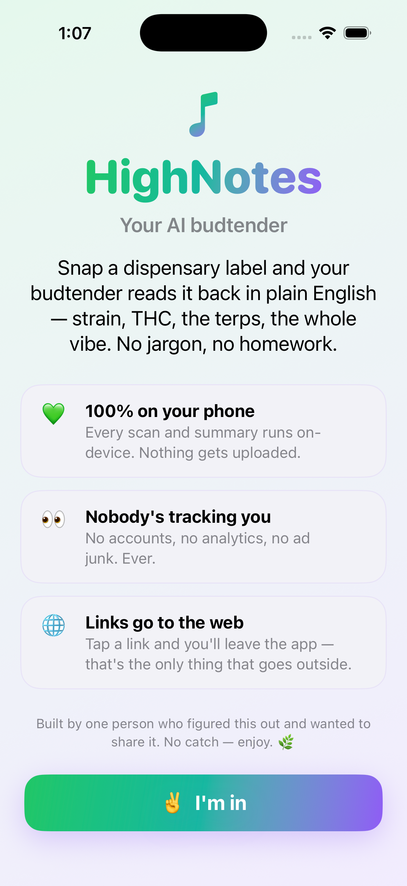
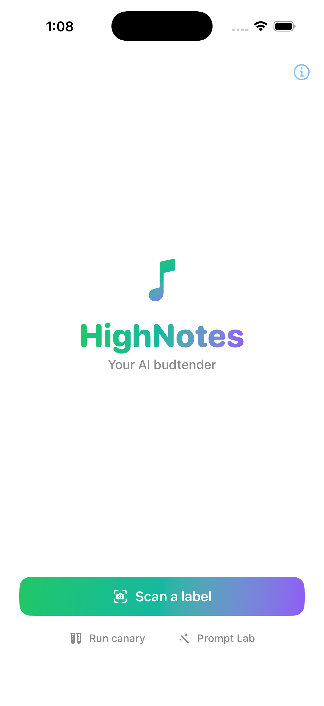

<div align="center">


# HighNotes

**Your AI budtender.**

Scan a cannabis dispensary label and get a plain-English breakdown — strain, cannabinoids, terpenes, provenance — generated entirely on your phone.

📱 iOS 26+ &nbsp;·&nbsp; 🔒 100% on-device &nbsp;·&nbsp; 🚫 No tracking &nbsp;·&nbsp; 💸 $0 infrastructure

<br/>


&nbsp;&nbsp;&nbsp;


</div>

## What it is

HighNotes turns a photo of a regulated dispensary label into a structured, trustworthy read. Point the camera at a label (or import one from your photo library) and it OCRs the text, extracts the fields with an on-device LLM, sanity-checks the chemistry, and writes a grounded summary — no dispensary jargon, no homework. Nothing is uploaded; nothing is tracked. The only things that ever leave the app are you tapping an external link, and — if you choose to — an optional tip through the App Store.

## How it works

| Stage | Tech |
|---|---|
| Live capture | VisionKit `DataScannerViewController` — OCR text + barcode/QR in one component |
| Still capture | Vision still-image OCR (`StaticImageOCR`, auto-orientation) for imported photos |
| Structured extraction | Foundation Models — two-pass: parse a `CannabisLabel` `@Generable` struct from the OCR text |
| Interpretation | Foundation Models again — a grounded, plain-English summary built from the parsed struct |
| Safety layer | `LabelSanityChecker` (Total-THC formula + productType rules), P6 regex/regen/fallback validator, user-correctable strain intelligence |
| Storage | Local JSON (strain overrides) + `@AppStorage`; SwiftData deferred until journaling lands |
| Enrichment | Optional COA / product links when a QR resolves to one |

**Device gating — iOS 26.0+ minimum.** Foundation Models' stable public `@Generable` macro is `@available(iOS 26.0, *)`, and the AI path additionally needs Apple-Intelligence-capable hardware (iPhone 15 Pro / 16 / 17 series, M-series iPad). On hardware without it, you still get the scan + structured-data view; the AI features gate off gracefully. There is no cloud LLM fallback — "100% on-device" is a load-bearing product claim.

## Privacy

- Scanning **and** the AI summary run on-device. No network calls in the core flow.
- No accounts, no analytics, no ad SDKs.
- The one network exception is the optional tip jar (StoreKit / App Store) — only when you choose to tip, and it carries no personal data.
- The first-run welcome states this plainly, and the in-app **About** screen restates it.

## Build & run

The Xcode project is generated from `project.yml` by [`xcodegen`](https://github.com/yonaskolb/XcodeGen) (`brew install xcodegen`). The signing team is committed in `project.yml`, so regens no longer break device signing.

```bash
xcodegen generate                       # regenerate weedlabel.xcodeproj after adding files
open weedlabel.xcodeproj                 # then ⌘R on an iOS 26 device or simulator

# Or from the CLI (any installed iOS 26 simulator):
xcodebuild -scheme weedlabel -destination 'platform=iOS Simulator,name=iPhone 17 Pro' build
xcodebuild -scheme weedlabel -destination 'platform=iOS Simulator,name=iPhone 17 Pro' test
```

> Foundation Models and `DataScannerViewController` both require iOS 26.0+. The `@Generable` extraction path needs Apple-Intelligence-capable hardware to exercise end-to-end; the iOS 26 simulator covers most of it.

## Documentation

The durable specs live in [`docs/`](docs/) — read these before non-trivial changes:

- [`PRD-v1.md`](docs/PRD-v1.md) — product requirements, personas, reliability tiers
- [`SAD-v1.md`](docs/SAD-v1.md) — software architecture, pipeline, safety layers, signing
- [`UXD-v1.md`](docs/UXD-v1.md) — UX flows and screens
- [`EXECUTION-LOG-2026-05.md`](docs/EXECUTION-LOG-2026-05.md) — how the spike became v1
- [`OPEN-ISSUES.md`](docs/OPEN-ISSUES.md) — known issues and open decisions
- [`docs/legacy/`](docs/legacy/) — the superseded Next.js/Supabase PWA v0.1, kept only for the durable *why*

## Status

**Device-tested v1 spike** (2026-05). On-device scan → two-pass extraction → strain intelligence → grounded summary, with high-res capture, a correctable strain DB, and an optional tip jar. 224 tests passing. The product is **HighNotes**; the repo, Xcode target, and bundle id still read `weedlabel` (rename deferred).

## Money

Free. No paywall — ever. The goal is for people to use it and find it useful. Revenue, if any, comes from an **optional tip jar** (tip if you can, don't if you can't) — now built, tucked away in the About screen, three StoreKit consumable tiers. Monetized external links are a possible-later option. Neither will ever gate the app. (Apple requires developer tips to be In-App Purchases, so the tip jar uses StoreKit; production tips just need the products registered in App Store Connect.)

## Why iOS native (not web)

The original direction was a Next.js PWA with cloud vision through a Supabase Edge Function (preserved in `docs/legacy/`). The pivot to native iOS happened because Foundation Models gives a free on-device LLM with structured `@Generable` output — collapsing the entire backend — while VisionKit does live OCR + barcode in one component. The result: real privacy and $0 ongoing infrastructure, which is exactly the wedge for cannabis users. Scanning regulated dispensary labels is open whitespace; competitors do flower visual ID, manual journals, or hardware.

## Predecessor

Old repo: [nickdnj/nj-weed-label-app](https://github.com/nickdnj/nj-weed-label-app) — archived 2026-05-09. Contained the Next.js PWA discovery + PRD/SAD v0.1, now distilled into `docs/legacy/`.
